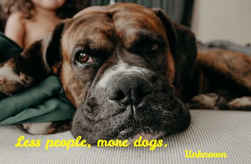
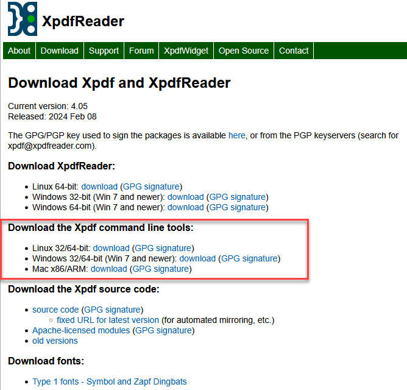

# Meme Generator
  
## Description
The meme generator app is a small application designed to generate memes from 2 sources - Internet link for picture with a custom text and author or from a given database of pictures and texts.  
The code comes with a small collection of pictures and quotes supplied by Udacity and some additional quotes found online (https://woofsie.com/blogs/news/funny-dog-quotes, https://woofsie.com/blogs/news/dog-mom-quotes) and some pictures saved also from the given links.  
As the supplied pictures and texts highly relate to dogs, it is advised to either change all pictures and quotes for a chossen theme or adapt the code to assign meaningfull quotes to the loaded picture.  
The motivation for the project was a project part of Udacty's nanodegree program [Intermediate python (nd303)]([text](https://www.udacity.com/enrollment/nd303))  
The project includes both Flask based web interface and a command line interface.  
Both interfaces save generated memes to the hard drive in the folders static and tmp.  

## Atributions
* Part of the code was provided by Udacity, including part of pictures and quotes.  
* https://woofsie.com/blogs/news/funny-dog-quotes  
* https://woofsie.com/blogs/news/dog-mom-quotes  

## Prereqisites
* Download and insatll the [pdftotext](https://www.xpdfreader.com/download.html) command line tool.  
  
* Install all dependencies necessary to run the code given in the requirements.txt file.  
* Install custom font, if desired and modify code in MemeEngine\memeengine.py in the function set_font.  
Current font is provided in \_data\fonts and was downloaded from [Google fonts](https://fonts.google.com/specimen/Leckerli+One).  

## Instalation
* It is recomended to create a virtual environment for this project.  
When using Anaconda, create a virtual environment with:  
````conda create--name myvirtenv (use an appropriate name)````  
* Activate virtual environment
````conda activate myvirtenv````
* To deactivate, use:
````conda deactivate````


## Usage
1. Using the Command line interface
Depending on how Python is installed, you can call the app by typing:  
```sh
`python meme.py [--path] [--body] [--author]`  
options:
  -h, --help       show this help message and exit  
  --path PATH  
  --body BODY  
  --author AUTHOR  
```
__Example:__  
`python meme.py`  
Meme generated viw the cli will be saved in the ```.\tmp``` folder.  
```_Your meme was saved at D:\xxx\UDACITY\Intermediate Python\meme_generator_project\tmp\38035466.jpg_```  

2. Flask Web Development Server  
Call:  
`python app.py`  
In the terminal window, following message will appear:  
```sh
 * Serving Flask app 'app'                                                                                                                                                                                                          
 * Debug mode: off                                                                                                                                                                                                                  
WARNING: This is a development server. Do not use it in a production deployment. Use a production WSGI server instead.                                                                                                              
 * Running on http://127.0.0.1:5000
Press CTRL+C to quit 
```

Click on the link http://127.0.0.1:5000  

Here, 2 options are offered:
- Random - generate a random meme from the pictures and quotes on the computer
- Custom - user needs to provide the link to the desired image, a quote and an author.

Both options will save the meme in the ```.\static``` folder.

## Contact
[Andrei Filep]([text](https://www.filep-race-engineering.com/))